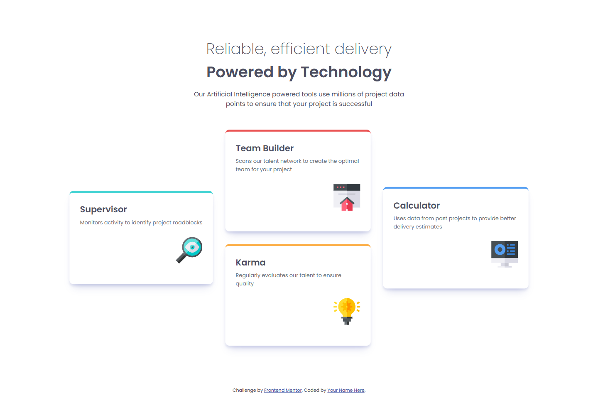
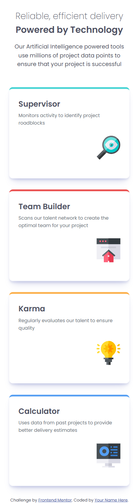

# Frontend Mentor - Four card feature section solution

This is a solution to the [Four card feature section challenge on Frontend Mentor](https://www.frontendmentor.io/challenges/four-card-feature-section-weK1eFYK). Frontend Mentor challenges help you improve your coding skills by building realistic projects.

## Table of contents

- [Overview](#overview)
  - [The challenge](#the-challenge)
  - [Screenshot](#screenshot)
  - [Links](#links)
- [My process](#my-process)
  - [Built with](#built-with)
  - [What I learned](#what-i-learned)
  - [Continued development](#continued-development)
- [Author](#author)

## Overview

### The challenge

Users should be able to:

- View the optimal layout for the site depending on their device's screen size

### Screenshot

#### Desktop



#### Mobile



### Links

- Solution URL: [Frontend Mentor](https://www.frontendmentor.io/solutions/four-cards-feature-section-using-css-grid-OsJIv5zEJ9)
- Live Site URL: [GitHub](https://anhvu1012.github.io/Four-card-feature-section/)

## My process

### Built with

- Semantic HTML5 markup
- CSS custom properties
- Flexbox
- CSS Grid
- Mobile-first workflow

### What I learned

I learned how use work with CSS Grid, especially with grid-area and grid-template in this case.

```css
.main-container {
  display: grid;
  grid-template:
    'supervisor team calculator'
    'supervisor team calculator'
    'supervisor karma calculator '
    'supervisor karma calculator';
  grid-gap: 30px;
  align-items: center;
  justify-content: center;
  margin-bottom: 100px;
}
```

### Continued development

The only thing I can't seem to get it done is the straight inner top left and top right border of the 4 cards :/

Someday I will find out!

## Author

- Frontend Mentor - [@anhvu1012](https://www.frontendmentor.io/profile/anhvu1012)
